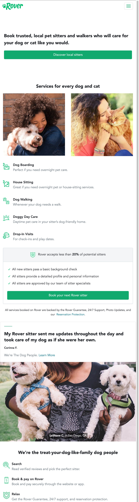
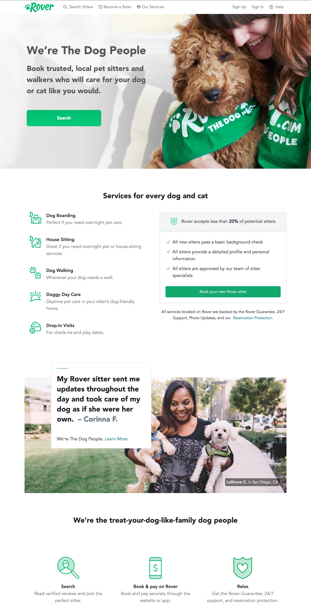

# Responsive Lab

## Rover

It’s time to review what we’ve learned so far and combine all of our new skills by designing a responsive, interactive site called Rover.

Your goal is to add CSS and JavaScript so that the site matches the provided screenshots and has the functionality requested in the JavaScript file.

Remember: Use your resources, ask questions, try things one step at a time, and don’t give up!

## Designs

### Mobile

### Desktop

